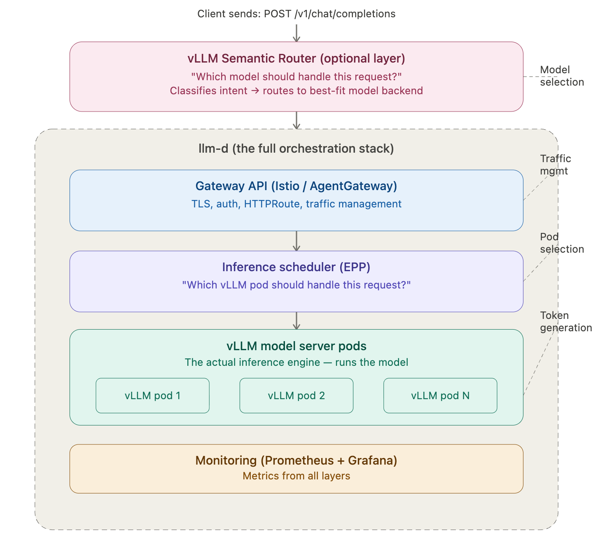

# Full LLM inference stack on local Kubernetes

**Stack:** vLLM Semantic Router → Gateway (with Inference Extension EPP) → llm-d ModelService → vLLM (CPU) + DRA

Single Envoy-based gateway stack.
Gateway is both the traffic proxy AND llm-d's gateway provider.
The Inference Gateway Extension (EPP) plugs into the same Envoy proxy for KV-cache-aware routing to vLLM pods.

---

## Architecture



```
Client request (OpenAI-compatible)
    │
    ▼
┌────────────────────────────────────────────────────┐
│  vLLM Semantic Router                              │
│  Classifies request → picks self-hosted or cloud   │
│  (CPU only, runs embedding classifier)             │
└──────────┬─────────────────────────────────────────┘
           │ routing decision (backend URL)
           ▼
┌────────────────────────────────────────────────────┐
│  llm-d (the full orchestration stack)              │
│  ┌──────────────────────────────────────────────┐  │
│  │ LLM features:                                │  │
│  │  • Token rate limiting                       │  │
│  │  • API format translation (OpenAI↔Anthropic) │  │
│  │  • Provider credential injection             │  │
│  │  • Provider failover                         │  │
│  └──────────────────────────────────────────────┘  │
│  ┌──────────────────────────────────────────────┐  │
│  │ Gateway API (Istio / AgentGateway):          │  │
│  │  • TLS, load balancing, retries              │  │
│  │  • Gateway API implementation                │  │
│  └──────────────────────────────────────────────┘  │
│  ┌──────────────────────────────────────────────┐  │
│  │ Inference Gateway Extension (EPP):           │  │
│  │  • KV-cache-aware endpoint selection         │  │
│  │  • Load-aware, criticality-aware routing     │  │
│  │  • Plugs into same Envoy via ext_proc        │  │
│  └──────────────────────────────────────────────┘  │
└──────┬──────────────────────────────┬──────────────┘
       │ self-hosted                   │ cloud
       ▼                               ▼
┌──────────────────┐          ┌──────────────────┐
│  llm-d            │          │  OpenAI API      │
│  ModelService     │          │  (external)      │
│  ┌──────────────┐ │          └──────────────────┘
│  │ vLLM (CPU)   │ │
│  │ Qwen 0.5B    │ │
│  └──────────────┘ │
│  DRA: true        │
│  (simulated GPUs) │
└──────────────────┘
```
