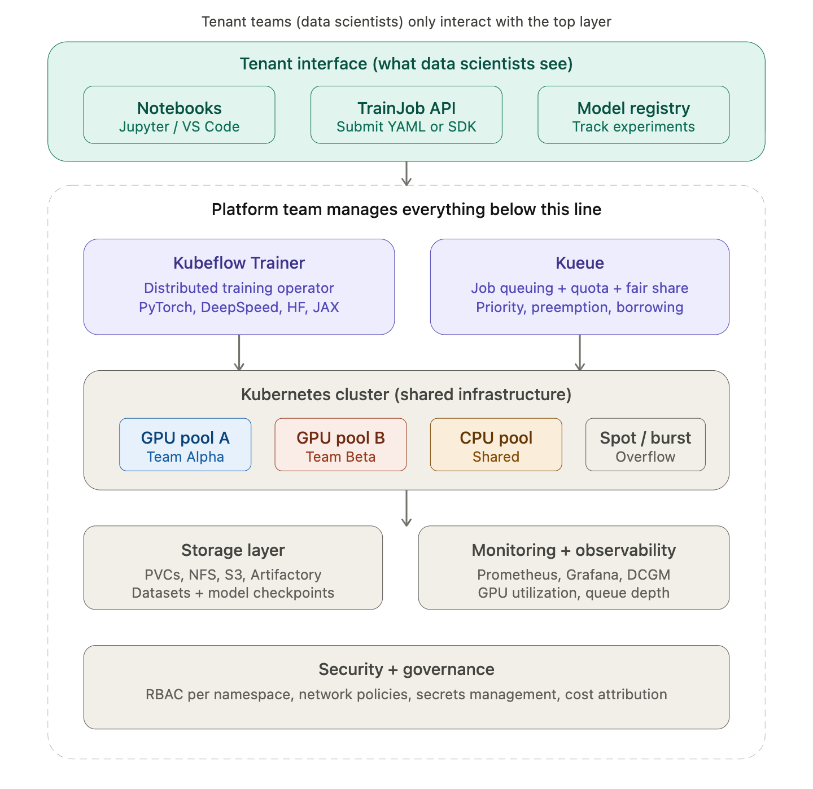

## Training

The two core open-source projects that make this work

- Kubeflow Trainer is the training equivalent of what vLLM is for inference. It's a Kubernetes-native distributed AI platform for scalable LLM fine-tuning and training across frameworks including PyTorch, HuggingFace, DeepSpeed, Megatron, JAX, and more. It handles the hard distributed training orchestration — splitting a job across multiple GPUs/nodes, coordinating gradient synchronization, managing MPI communication — so your data scientists don't have to.
- Kueue is the multi-tenancy layer. It provides Kubernetes with additional job queueing capabilities necessary for efficiently scheduling batch AI/ML workloads. This is the piece that solves the "how do 5 teams share 20 GPUs fairly" problem.

## Here's what the platform team vs. tenant team split looks like in practice:
  
- Platform team
  - Install Kubeflow Trainer operator
  - Install + configure Kueue
  - Set up GPU node pools + drivers
  - Define quotas per team (ClusterQueue)
  - Configure fair-share + preemption policies
  - Manage storage (PVCs, NFS, model cache)
  - RBAC: namespace-per-team isolation
  - Monitoring dashboards (GPU util, queue)
  - Base container images with frameworks
  - Cost attribution + chargeback

- Tenant team
  - Write training script (PyTorch / HF)
  - Submit a TrainJob YAML (or Python SDK)
  - Pick number of GPUs + workers
  - Point to their dataset
  - Monitor their job's logs + metrics
  - Download checkpoints when done

## The recommended open-source stack

| Layer | Tool | Role | Job submission |
| --- | --- | --- | --- |
| **Job submission** | Kubeflow Trainer | Distributed training operator (PyTorch, DeepSpeed, etc.) |  |
| **Queuing + quotas** | Kueue | Multi-tenant job queuing, fair sharing, preemption |  |
| **Orchestration** | JobSet / LeaderWorkerSet | Co-scheduling multi-pod training jobs |  |
| **Experiment tracking** | MLflow or Kubeflow Model Registry | Track runs, metrics, model versions |  |
| **Notebooks** | Kubeflow Notebooks | Jupyter/VS Code in K8s pods |  |
| **GPU management** | NVIDIA GPU Operator | Device plugin, drivers, MIG, DCGM monitoring |  |
| **Monitoring** | Prometheus + Grafana | GPU utilization, queue depth, job metrics |  |
| **Fault recovery** | AppWrapper (optional) | Auto-retry failed training jobs |  |
| **Inference (post-train)** | vLLM + llm-d | Serve the trained model |  |

## Hands-on walkthrough

Mirrors the inferencing walkthrough (`02-gateway` → `06-vllm-cpu`). Reuses `00-k8s/` and `01-dra/`.

| Dir | Owner | What it installs |
| --- | --- | --- |
| [./07-kueue](./07-kueue/README.md) | Platform | Kueue + ResourceFlavors + ClusterQueue + LocalQueue |
| [./08-kubeflow-trainer](./08-kubeflow-trainer/README.md) | Platform | Trainer v2 operator + ClusterTrainingRuntime (CPU + GPU) |
| [./09-training-storage](./09-training-storage/README.md) | Platform | HF-cache + checkpoints PVCs (RWX) |
| [./10-trainjob-simulator](./10-trainjob-simulator/README.md) | Tenant | Fake TrainJob — proves end-to-end flow |
| [./11-trainjob-hf-cpu](./11-trainjob-hf-cpu/README.md) | Tenant | Real HF LoRA fine-tune → writes checkpoint → served by `06-vllm-cpu` |
| [./12-mlflow](./12-mlflow/README.md) | Platform | MLflow tracking + model registry (Postgres backend, PVC or S3 artifacts) |
| [./13-volcano](./13-volcano/README.md) | Platform | Batch scheduler — gang + NUMA/network topology (layers under Trainer via `schedulerName: volcano`) |
| [./14-argo-workflows](./14-argo-workflows/README.md) | Platform | Pipeline DAG: prep → train → eval → register → approve → promote |
| [./15-eval-gate](./15-eval-gate/README.md) | Platform | Mandatory eval step (local: toy Q/A; prod: lm-evaluation-harness) |

See [./demo-training-e2e.md](./demo-training-e2e.md) for a scripted walk-through that stands the whole stack up and submits both TrainJobs.

### Best-of integration (why all four — Trainer, Volcano, JobSet, Kueue — and not pick one)

Each tool does one job well; stacking them gives you something no single tool provides:

| Layer | Tool | What it uniquely contributes |
| --- | --- | --- |
| Admission | **Kueue** | Quota enforcement + multi-tenant borrowing (K8s SIG native) |
| Persona abstraction | **Kubeflow Trainer v2** | ClusterTrainingRuntime / TrainJob — mirrors the Gateway API Inference Extension split exactly |
| Execution substrate | **JobSet** | Stable SIG API, used by Trainer internally — no extra install |
| Scheduling | **Volcano** | Gang scheduling, NUMA, network-topology, binpack for GPU cost |
| Device binding | **DRA** | NVLink-domain-aware GPU attachment |
| Orchestration | **Argo Workflows** | Pipeline DAG around training (Trainer doesn't do DAGs) |
| Tracking / registry | **MLflow** | Experiments + model versions + stages |

Ray (via KubeRay) is deliberately **not** core. It's an escape hatch for workloads that outgrow the PyTorch / JobSet model — e.g. reinforcement learning with dynamic actors. Add it per-team, not as a platform default.

### The GPU extension story

Every CPU manifest has a `*-production.yaml` sibling (pattern borrowed from `01-dra/dra-manifests-production.yaml`). Moving to real GPUs is entirely a **platform-side** change:

| Platform change | File |
| --- | --- |
| Add GPU ResourceFlavor + DRA quota to Kueue | `07-kueue/kueue-production.yaml` |
| Add GPU ClusterTrainingRuntime (DRA claim, CUDA image) | `08-kubeflow-trainer/02-training-runtime-gpu-production.yaml` |
| Point PVCs at an RWX class (NFS / EFS / Filestore) | `09-training-storage/*.yaml` (`storageClassName`) |

Tenant YAML (`10-*`, `11-*`) changes by **one line**: `runtimeRef.name: torch-distributed-gpu`.