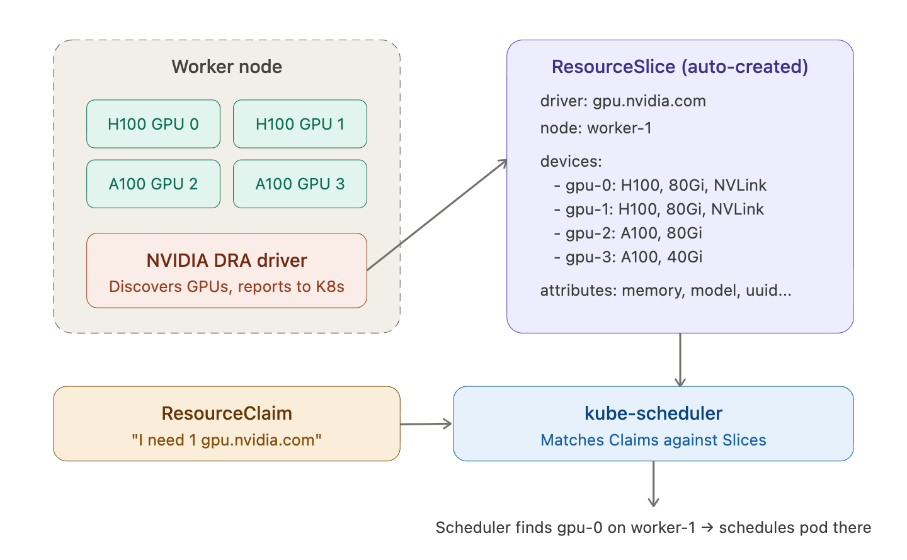

## DRA Flow

The flow is:
- DRA driver starts on each node — it scans the hardware (e.g., NVIDIA driver discovers 4 GPUs)
- Driver creates ResourceSlices — one or more per node, listing every device with its attributes (model, memory, UUID, NVLink domain, driver version)
- Scheduler reads ResourceSlices — when a pod has a ResourceClaim, the scheduler searches all ResourceSlices for a device matching the DeviceClass selectors and any CEL filters
- Match found → pod scheduled to that node — the kubelet then calls the DRA driver to attach the device to the pod



## DRA Example Driver

This example driver advertises simulated GPUs to Kubernetes for your Pods to interact with. Kubernetes It creates fake GPU devices — no real hardware needed.
```
cd /tmp

rm -rf dra-example-driver

git clone https://github.com/kubernetes-sigs/dra-example-driver.git

cd dra-example-driver

helm install dra-example-driver deployments/helm/dra-example-driver \
  --namespace dra-example-driver \
  --create-namespace

# Verify
kubectl get pod -n dra-example-driver

kubectl get resourceslices (Automatically created by the driver,Cluster Scoped)

kubectl get deviceclass (Automatically created by the driver,Cluster Scoped : Defines hardware categories)
```

## Create ResourceClaimTemplate

```
kubectl apply -f 01_resourceclaim_template.yaml

kubectl get resourceclaimtemplate -n default
```

## Create an example pod that references this claim to see DRA in action
```
kubectl apply -f 02_example_pod.yaml

kubectl get pod dra-test-pod

# It should show Pending — because there's no DRA driver providing ResourceSlices with devices matching gpu.walmart.com

kubectl describe pod dra-test-pod

# Look for the Events section
```

