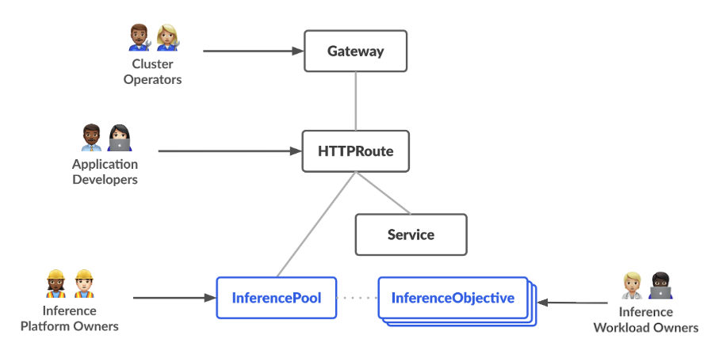

## Introduction

Inference Extension (EPP) is an upstream Kubernetes SIG project `(kubernetes-sigs/gateway-api-inference-extension)`. It's part of the Gateway API ecosystem, not owned by llm-d. It provides the generic InferencePool CRD and the reference EPP implementation that works with any Envoy-based gateway (Istio, Envoy Gateway, GKE Gateway, NGINX).

Gateway API Inference Extension optimizes self-hosting Generative Models on Kubernetes. More details can be found here: https://gateway-api-inference-extension.sigs.k8s.io/ 

The overall resource model focuses on 2 new inference-focused personas and corresponding resources that they are expected to manage:



*llm-d* builds on top of the Inference Extension. It has its own fork/extension of the EPP `(llm-d/llm-d-inference-scheduler)` that adds llm-d-specific plugins: KV-cache aware routing, disaggregated prefill/decode scheduling, prefix-cache scoring, LoRA-aware routing. These are plugins that plug into the EPP's extensible architecture.

## Creating the InferencePool + EPP that routes traffic to pods serving the model

*LLM-D* uses an API resource called InferencePool alongwith a scheduler (referred to as the LLM-D inference scheduler and sometimes equivalently as EndPoint Picker/ EPP). This is the smart routing layer. It has two parts:

- InferencePool — a custom resource that tells the EPP "find all pods matching these labels, they're serving this model"
- EPP (Endpoint Picker Proxy) — the actual process that receives requests from the Gateway, picks the best pod, and forwards the request

```
# Install Inference Extension CRDs:

kubectl apply --server-side -f https://github.com/kubernetes-sigs/gateway-api-inference-extension/releases/download/v1.4.0/manifests.yaml

# Install the InferencePool chart, configured to discover our simulator pods:

helm install sim-pool \
  oci://registry.k8s.io/gateway-api-inference-extension/charts/inferencepool \
  --namespace vllm-simulator \
  --set inferencePool.modelServers.matchLabels.app=vllm-simulator \
  --set inferencePool.targetPortNumber=8000 \
  --dependency-update \
  --set provider.name=istio \
  --version v1.4.0 \
  --set inferenceExtension.image.hub=ghcr.io/llm-d \
  --set inferenceExtension.image.name=llm-d-inference-scheduler \
  --set inferenceExtension.image.tag=latest \
  --set inferenceExtension.resources.requests.cpu=50m \
  --set inferenceExtension.resources.requests.memory=128Mi \
  --set inferenceExtension.resources.limits.memory=256Mi
```

What this just created:

- An InferencePool custom resource that says "look for pods with label app=vllm-simulator on port 8000"
- An EPP Deployment (a Go binary) that watches those pods, collects their load/cache metrics, and makes routing decisions
- A Service for the EPP's gRPC endpoint that the Gateway will call for each incoming request 

## Important Note

If you need to add more models, you can install more InferencePools, each with a different selector to match the pods for that model. Respective EPP deployment and service will be created automatically.
```
helm install math-pool    oci://registry.k8s.io/.../inferencepool --set ...matchLabels.app=math-vllm
```
 
## Verify

```
kubectl get inferencepool -n vllm-simulator -o yaml

kubectl get svc -n vllm-simulator
```

## Create HTTPRoute to point to InferencePool

```
kubectl apply -f sim-http-route.yaml
```

## Verify the HTTPRoute

```
kubectl get httproute -n vllm-simulator -o yaml

# Get Gateway IP
kubectl get svc -n gateway-system

curl -v http://192.168.139.2/v1/chat/completions \
  -H "Content-Type: application/json" \
  -H "x-model-name: simulator" \
  -d '{"model":"base-model","messages":[{"role":"user","content":"Hello"}]}'

If you get a streamed response back, you've got the full flow working: Client → Istio Gateway → EPP (smart routing) → Simulator Pod  

Few things to note:

1. The model field in the request body is standard OpenAI API format. Every component in the chain understands it.
2. When your request hits Istio → EPP, the EPP reads the request body, extracts the model field, and uses it to route. The EPP knows about the simulator pods because the InferencePool's selector matches them (app: vllm-simulator).
3. EPP also knows what model name the simulator is serving. For example, in our case, the simulator pods are serving the model named "base-model". The simulator was started with --model base-model, so it reports itself as serving a model called base-model. The EPP discovers the model name by scraping each pod's /v1/models endpoint
4. When you send "model": "base-model": EPP sees the model name matches what the simulator pods advertise → routes to a simulator pod → 200 OK
5. When you send "model": "non-existent-model": EPP sees no pod advertises "non-existent-model" → returns 404 Not Found

```

## Deploy InferenceObjective (Optional)


## Deploy the Body Based Router Extension (Optional)


## Latency-Based Routing

## Explore more features of llm-d InferenceScheduler

